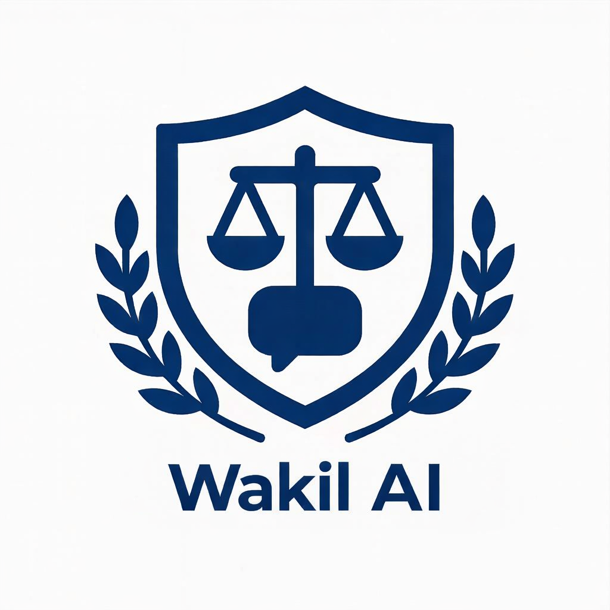

<div align="center">



# WakilAI

### Legal intelligence infrastructure for high-stakes legal work

**Source-grounded legal AI · Enterprise APIs · Private deployment · Multilingual intelligence**

[Website](https://wakil.ai) ·
[Launch WakilAI](https://chat.wakil.ai) ·
[Contact](mailto:support@wakil.ai)

</div>

---

## Legal AI built for evidence, control, and deployment flexibility

WakilAI helps legal professionals and organizations research law, analyze
documents, and build controlled AI-assisted workflows for Uzbekistan's legal
environment.

Our approach combines structured legal data, evidence retrieval, document
intelligence, and configurable deployment infrastructure. The goal is simple:
important legal outputs should be grounded in relevant sources and suitable for
professional review.

> Legal AI should do more than generate an answer. It should make the basis of
> that answer clear.

WakilAI is designed for law firms, enterprises, public institutions, legal-aid
organizations, and technology partners that need more than a general-purpose AI
assistant.

## Platform capabilities

<table>
<tr>
<td width="50%" valign="top">

### Legal intelligence

- Source-grounded legal research
- Article- and provision-level retrieval
- Regulatory and procedural analysis
- Multi-source research workflows
- Context-aware legal conversations

</td>
<td width="50%" valign="top">

### Document intelligence

- Contract and document analysis
- Drafting assistance
- Risk, obligation, and clause extraction
- Document comparison
- Case-file and uploaded-document analysis

</td>
</tr>
<tr>
<td width="50%" valign="top">

### Enterprise platform

- Organization workspaces
- Matter-oriented collaboration
- Role-aware access
- Private knowledge bases
- API and system integrations

</td>
<td width="50%" valign="top">

### Controlled deployment

- Managed and private-cloud options
- On-premises deployment
- Configurable model infrastructure
- Customer-controlled data boundaries
- Institution-specific knowledge systems

</td>
</tr>
</table>

## Designed for legal precision

General-purpose AI primarily optimizes for fluent language. Legal work also
requires evidence quality, contextual accuracy, and traceability.

WakilAI separates retrieval, evidence evaluation, and synthesis so organizations
can build reviewable workflows around legal information.


Depending on the task, retrieval can combine semantic, lexical,
terminology-sensitive, precision-first, and relationship-aware methods.

## Structured legal knowledge

WakilAI is designed to preserve the hierarchy and context of legal material
rather than treating law as an undifferentiated collection of text.

```text
Legal instrument
└── Title
    └── Chapter or section
        └── Article or provision
```

This structure helps connect a provision to its governing instrument and supports
more precise retrieval across legislation, regulations, court materials,
contracts, and organization-specific knowledge.

## Specialized workflows

| Area | Example workflows |
| --- | --- |
| General law | Legal questions, statutory research, rights, and obligations |
| Tax and regulatory | Regulatory research, obligations, and interpretation |
| Court intelligence | Case materials, procedure, and court research |
| Contracts | Drafting, review, comparison, risk, and obligation analysis |
| Deep research | Multi-source investigation and structured analysis |
| Case workspaces | Documents, facts, conversations, and research within a matter |

## Multilingual by design

Uzbekistan's legal environment spans multiple languages and scripts. WakilAI is
designed to support:

- Uzbek in Latin script
- Uzbek in Cyrillic script
- Russian
- English

Multilingual processing can be applied at the retrieval layer, helping the system
find relevant evidence across languages instead of translating only the final
response.

## Enterprise integration

WakilAI can operate as a legal intelligence layer within an organization's
existing environment.

- REST APIs and server-to-server integrations
- Web and embedded experiences
- Internal enterprise tools
- Institution-specific assistants
- Private knowledge and document workflows
- White-label legal AI experiences

Implementations can combine an organization's documents, policies, templates,
and workflows with WakilAI's legal intelligence capabilities.

## Deployment models

| Model | Best suited for |
| --- | --- |
| Managed cloud | Rapid deployment and standard workloads |
| Private cloud | Dedicated infrastructure and stronger isolation requirements |
| On-premises | Regulated or sensitive environments with local-control requirements |
| API or embedded | Existing products, portals, and enterprise systems |
| White label | Organizations delivering a branded legal AI experience |

Deployment scope and controls are configured for each engagement. Availability
of individual options depends on technical and operational requirements.

## Security and governance

Legal workloads require disciplined access, data handling, and oversight. WakilAI
deployments can be designed around controls such as:

- Authentication and role-aware authorization
- Tenant and data-isolation boundaries
- Controlled API and administrative access
- Secure document handling
- Secret-management practices
- Operational logging and monitoring
- Evidence and source traceability
- Private infrastructure options

Detailed architecture, security, and data-handling documentation can be shared
with qualified enterprise and institutional partners under appropriate
confidentiality arrangements.

Security capabilities depend on the agreed deployment and configuration. Public
materials should not be interpreted as an independent certification or a
guarantee of suitability for a particular regulatory regime.

## Built for professional workflows

WakilAI is evolving from question answering into a broader environment for legal
work:

```text
Ask → understand context → retrieve evidence → evaluate evidence
    → analyze → generate a grounded output → review → continue within a matter
```

This supports workflows across legal teams, compliance, tax, procurement,
finance, human resources, operations, and public-service delivery—subject to the
organization's policies and professional oversight.

## Responsible legal AI

WakilAI is designed to assist legal work, not replace professional legal
judgment.

- **Evidence over speculation.** Important outputs should be supported by
  relevant legal material.
- **Clarification over guessing.** Material ambiguity should be surfaced instead
  of silently assumed.
- **Traceability over black-box confidence.** Users should be able to review the
  basis of significant outputs.
- **Human judgment for high-stakes decisions.** Qualified professionals should
  review consequential legal conclusions and actions.

WakilAI provides legal information and AI-assisted legal intelligence. It does
not replace licensed legal counsel or judicial decision-making.

## Open source and developer resources

This organization hosts selected WakilAI SDKs, integration examples,
documentation, and open-source components. Core production infrastructure and
proprietary legal knowledge systems may remain private.

Public repositories are released where they can contribute to the legal-technology
and developer ecosystems without compromising customer confidentiality,
security, personal data, or proprietary systems.

## Work with WakilAI

We work with law firms, enterprises, legal-technology companies, public
institutions, universities, and technology partners.

For enterprise deployment, API access, integrations, partnerships, or
institutional pilots:

- [support@wakil.ai](mailto:support@wakil.ai)
- [wakil.ai](https://wakil.ai)
- [chat.wakil.ai](https://chat.wakil.ai)

<div align="center">

**Building trusted legal intelligence for Uzbekistan—and the markets that come next.**

</div>
